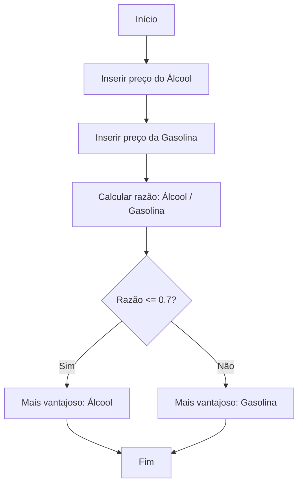

# 🚗 Aplicativo Álcool ou Gasolina
 

Aplicativo desenvolvido para ajudar os motoristas a decidirem se é mais vantajoso abastecer o carro com álcool ou gasolina com base no preço de ambos os combustíveis. A lógica é a seguinte:

- O aplicativo calcula a razão entre o preço do litro do álcool e o preço do litro da gasolina.
- Caso a razão (preço do álcool / preço da gasolina) seja menor ou igual a 0,7, é mais vantajoso abastecer com álcool.
- Caso contrário, é mais vantajoso abastecer com gasolina.

## 📱 Funcionalidades
- **Entrada de dados**: O usuário insere o preço do litro de álcool e gasolina.
- **Cálculo**: O aplicativo calcula a relação entre os preços.
- **Resultado**: O app informa qual combustível é mais vantajoso de acordo com o cálculo.

## 📙 Conhecimentos
Este aplicativo foi criado com o objetivo de praticar o uso do **Kotlin** e o conceito de **Intents** no Android para realizar a troca entre **Activitys**. Além disso, também envolveu o uso de **View Components** como **EditText**, **Button** e **TextView** para a interação com o usuário. Este projeto foi desenvolvido com fins de estudo, visando aprimorar habilidades no desenvolvimento de aplicativos Android.

## 📊 Diagrama de fluxo:

## 🧑‍💻 Contato
Entre em contato! 😁

**Bruno Vivian Carvalho**

